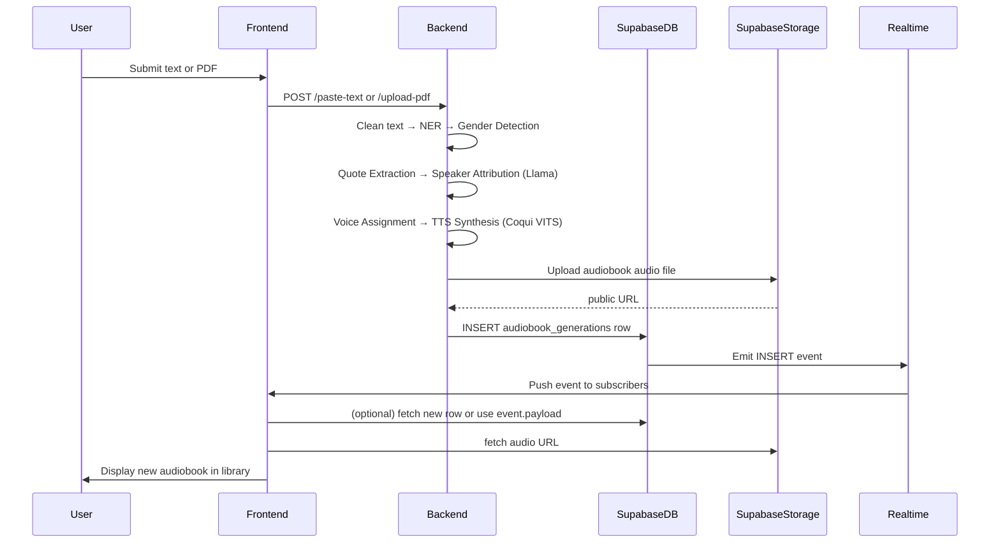

# Text-to-Speech Audiobook Generation System

A speaker-aware, multi-speaker audiobook generation system that converts PDF documents or raw narrative text into expressive audiobooks. Instead of relying on flat, single-voice narration, the system detects characters, infers their gender, attributes dialogue to the correct speaker using an instruction-tuned LLM, and synthesizes each character's lines in a distinct, consistent voice — served through a React frontend with a realtime-synced audiobook library backed by Supabase.

## Overview

Traditional TTS-based audiobook tools narrate everything in a single voice, which flattens dialogue-heavy narratives and makes it hard for listeners to track who's speaking. This project builds an end-to-end pipeline that:

- Extracts and cleans text from PDFs or pasted input
- Detects characters using an ensemble of NER models
- Infers character gender from narrative context using a fine-tuned LLM
- Extracts and tags dialogue (quotes) with localized context windows
- Attributes each quote to a speaker using a fine-tuned instruction-tuned LLM
- Assigns each character a persistent, gender-aware synthetic voice
- Synthesizes and merges the final multi-speaker audiobook
- Stores metadata and audio in Supabase and pushes new/updated audiobooks to the frontend in realtime

The system is composed of three main parts:

- **Frontend** — Vite + React + Supabase client. UI for paste-text/file upload, with a realtime-synced audiobook library.
- **Backend** — FastAPI. Runs the NER ensemble, gender detection, speaker attribution, and TTS generation, then pushes audio to Supabase Storage and metadata to Supabase Postgres.
- **Supabase** — Postgres table `audiobook_generations`, Storage bucket `audiobooks`, Realtime pub/sub for DB changes, and RLS policies.

## Features

- 📄 **PDF & raw text input** — accepts either a PDF document or pasted narrative text
- 🧠 **Ensemble character detection** — combines fine-tuned DistilBERT, spaCy, and Hugging Face BERT-based NER for robust character extraction
- ⚧ **Contextual gender inference** — fine-tuned Llama 3 8B (LoRA + Unsloth) reasons over narrative context instead of relying on pronoun matching
- 💬 **Quote extraction & tagging** — regex-based quote parsing with `<QUOTE>...</QUOTE>` tagging and asymmetric (right-weighted) context windows
- 🎯 **Candidate speaker generation** — distance-aware ranking narrows down likely speakers before attribution, reducing inference complexity
- 🗣️ **Llama-based speaker attribution** — fine-tuned `Llama-3.2-3B-Instruct-bnb-4bit` performs prompt-based contextual reasoning (replacing an earlier Longformer-based classifier) with deterministic decoding and fuzzy-match correction
- 🔊 **Neural multi-speaker TTS** — Coqui TTS with the VCTK VITS model, using persistent gender-aware voice assignment per character
- ⚙️ **Modular FastAPI deployment** — gender detection, speaker attribution, and TTS run as independent, API-connected services

## System Architecture

```
PDF / Paste Text
      ↓
Text Extraction & Cleaning
      ↓
Ensemble Character Detection (DistilBERT + spaCy + HF-BERT)
      ↓
Gender Detection (Llama 3 8B)
      ↓
Quote Extraction
      ↓
Context Window Construction (<QUOTE> tagging)
      ↓
Candidate Speaker Generation
      ↓
Llama-3.2-3B Speaker Attribution
      ↓
Voice Assignment (gender-aware)
      ↓
Coqui TTS (VITS)
      ↓
Final Audiobook
```

## Request / Data Flow



## Tech Stack

| Component               | Technology                            |
|--------------------------|----------------------------------------|
| Frontend                  | Vite, React, Supabase JS client        |
| Backend Framework         | FastAPI                               |
| Language                  | Python                                |
| NER Models                | DistilBERT, spaCy, HF-BERT            |
| Speaker Attribution Model | Llama-3.2-3B-Instruct-bnb-4bit (LoRA) |
| Gender Detection Model    | Llama 3 8B (LoRA)                     |
| Fine-tuning               | Unsloth, LoRA, 4-bit quantization     |
| Speech Synthesis          | Coqui TTS (VITS, VCTK)                |
| PDF Processing            | PyPDF2                                |
| Database                  | Supabase Postgres                     |
| File Storage              | Supabase Storage (`audiobooks` bucket)|
| Realtime Sync             | Supabase Realtime (postgres_changes)  |
| Access Control             | Supabase Row-Level Security (RLS)     |
| Inter-module Communication| REST API                              |
| Deployment Tunneling      | ngrok                                 |

## Database & Storage

**Table:** `audiobook_generations` (Postgres, via Supabase)

Example row:

```json
{
  "id": "...",
  "title": "My Story",
  "input_text": "Once upon a time...",
  "input_method": "text",
  "audio_url": "https://.../audiobook_123.mp3",
  "characters_detected": ["Narrator", "Meera"],
  "text_length": 5123,
  "generation_time_seconds": 10.5,
  "status": "completed",
  "message": "Audiobook generated successfully 🎧",
  "created_at": "2025-12-23T..."
}
```

- Audio files are uploaded to the **`audiobooks`** Storage bucket; the public/signed URL is written back into the row's `audio_url` field.
- **Row-Level Security (RLS)** policies control read/write access to generations.

## Realtime Sync (Frontend)

The frontend subscribes to Postgres changes on `audiobook_generations` so new or updated audiobooks appear in the library without a manual refresh.

Supabase JS (v2) example:

```ts
// src/lib/supabase.ts -> supabase client is already available
const channel = supabase
  .channel('public:audiobook_generations')
  .on('postgres_changes', { event: 'INSERT', schema: 'public', table: 'audiobook_generations' }, (payload) => {
    // payload.record contains the new row
    console.log('New audiobook:', payload.record);
  })
  .on('postgres_changes', { event: 'UPDATE', schema: 'public', table: 'audiobook_generations' }, (payload) => {
    console.log('Updated audiobook:', payload.record);
  })
  .subscribe();

// Remember to unsubscribe on unmount:
// channel.unsubscribe();
```

> If using the older `from(...).on(...).subscribe()` API, adjust accordingly.

## Pipeline Details

### 1. Text Extraction & Preprocessing
Extracts text from PDFs (via PyPDF2) or accepts raw pasted text, then normalizes whitespace, quotations, and formatting.

### 2. Ensemble Character Detection
Runs DistilBERT, spaCy, and HF-BERT NER models independently, merges outputs via union-based aggregation, and applies duplicate/chapter-title filtering plus heuristic narrator detection.

### 3. Contextual Gender Detection
A fine-tuned Llama 3 8B model predicts each character's likely gender (male/female/neutral) with a confidence score, based on surrounding narrative context rather than pronoun heuristics alone.

### 4. Quote Extraction & Context Construction
Regex-based parsing detects straight, curly, single-, and double-quoted dialogue. Each quote is wrapped in `<QUOTE>...</QUOTE>` tags, and a context window is built around it with more weight given to the right-side context (where attribution verbs like *said*, *replied*, *asked* typically appear).

### 5. Candidate Speaker Generation
Rather than scoring every detected character against every quote, nearby character mentions are ranked by proximity and only the top-k candidates are passed forward.

### 6. Speaker Attribution
A fine-tuned `Llama-3.2-3B-Instruct-bnb-4bit` model receives a structured prompt (context + tagged quote + candidate list) and returns the most likely speaker via greedy decoding, with fuzzy matching to correct minor output mismatches. This replaced an earlier Longformer-based classifier, which struggled with indirect references and multi-speaker passages.

### 7. Voice Assignment & Speech Synthesis
Each predicted speaker is mapped to a persistent synthetic voice from gender-aware voice pools. Coqui TTS (VITS, VCTK) synthesizes each dialogue segment independently.

### 8. Audiobook Generation
Synthesized segments are merged sequentially with pause insertion to produce the final audiobook file.

## Results Summary

- **Character detection**: Ensemble NER improved robustness over single-model NER, especially for multi-word names and ambiguous spans.
- **Gender detection**: Fine-tuned Llama 3 8B outperformed pronoun-based heuristics on ambiguous/indirect references.
- **Speaker attribution**: The Llama-3.2-3B instruction-tuned model outperformed the earlier Longformer-based classifier (~85% training / ~85.9% validation accuracy) in contextual reasoning, indirect reference handling, and multi-speaker consistency.
- **Audiobook output**: Multi-speaker narration with gender-aware voice assignment produced noticeably more immersive output than single-speaker synthesis.

## Challenges Addressed

- Inconsistent character extraction across writing styles → ensemble NER + cleanup heuristics
- Unreliable pronoun-only gender inference → contextual LLM-based reasoning
- Poor handling of indirect speaker references → switched from Longformer to instruction-tuned Llama with prompt engineering
- Training/inference prompt mismatches → standardized prompt templates and context construction across both stages
- GPU memory constraints → 4-bit quantization + LoRA fine-tuning
- Voice consistency across long audiobooks → persistent character-to-voice mapping

## Future Scope

- Emotion-aware speech synthesis
- Multilingual audiobook generation
- Real-time audiobook streaming
- Automatic narrator style adaptation
- Character emotion detection
- Improved long-context narrative reasoning
- Voice cloning for personalized narration
- Chapter-wise adaptive voice modulation

## Authors

- Abhilash Kashyap (220710007001)
- Chinmoy Sharma (220710007021)
- Vishal Kr. Sharma (220710007061)

**Guide:** Mr. Biswajit Sarma, Assistant Professor, Department of Computer Science and Engineering

**Institution:** Jorhat Engineering College, Jorhat, Assam
Department of Computer Science and Engineering — B.Tech, 2026

## References

1. Beltagy et al., *Longformer: The Long-Document Transformer*, 2020
2. Meta AI, *Llama 3: Open Foundation Models*, 2024
3. Hu et al., *LoRA: Low-Rank Adaptation of Large Language Models*, 2021
4. Coqui AI, *Coqui TTS Toolkit*, 2024
5. Kim, Kong & Son, *VITS: End-to-End Text-to-Speech*, 2021
6. Pan et al., *Cross-Lingual Name Tagging and Linking for 282 Languages*, 2017
7. Muzny, Fang & Zettlemoyer, *A Two-Stage Sieve Approach for Quote Attribution*, 2017
8. Unsloth AI, *Efficient Fine-Tuning for Large Language Models*, 2024
9. Shen et al., *Natural TTS Synthesis by Conditioning WaveNet on Mel Spectrogram Predictions*, 2018
10. Van Den Oord et al., *WaveNet: A Generative Model for Raw Audio*, 2016
