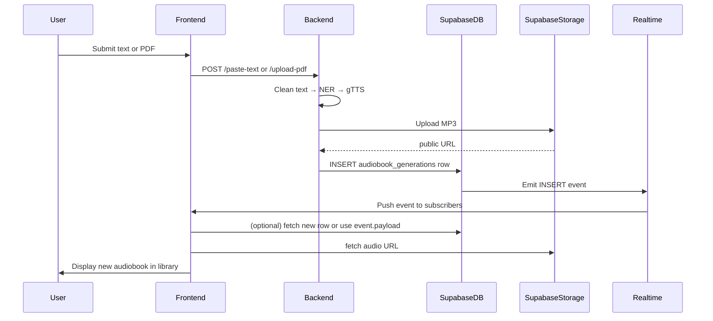

# AI Audiobook Generator — Architecture

> Brief: Component architecture, block diagrams, table schema, and realtime pub/sub flow for the project.

---

## Overview ✅

This project is composed of three main systems:

- **Frontend (Vite + React + Supabase client)** — UI for paste-text / file upload and a realtime-synced library.
- **Backend (FastAPI)** — NER ensemble (fine-tuned DistilBERT, spaCy, HF), TTS generation (gTTS), Supabase Storage for audio, and Supabase Postgres for metadata.
- **Supabase** — Postgres table `audiobook_generations`, Storage bucket `audiobooks`, Realtime pub/sub for DB changes, and RLS policies.

---

## Sequence Diagram (high level) 🔁



---


## Sample Supabase Realtime subscription (Frontend) ⚡

Supabase JS (v2) example — subscribe to INSERT & UPDATE events on `audiobook_generations`:

```ts
// src/lib/supabase.ts -> supabase client is already available
const channel = supabase
  .channel('public:audiobook_generations')
  .on('postgres_changes', { event: 'INSERT', schema: 'public', table: 'audiobook_generations' }, (payload) => {
    // payload.record contains the new row
    // update app state, optionally fetch details
    console.log('New audiobook:', payload.record);
  })
  .on('postgres_changes', { event: 'UPDATE', schema: 'public', table: 'audiobook_generations' }, (payload) => {
    console.log('Updated audiobook:', payload.record);
  })
  .subscribe();

// Remember to unsubscribe on unmount:
// channel.unsubscribe();
```

> If using the older `from(...).on(...).subscribe()` API replace accordingly.

---

## Example Row (JSON)

```json
{
  "id": "...",
  "title": "My Story",
  "input_text": "Once upon a time...",
  "input_method": "text",
  "audio_url": "https://.../audiobook_123.mp3",
  "characters_detected": ["Narrator", "Meera"],
  "text_length": 5123,
  "generation_time_seconds": 10.5,
  "status": "completed",
  "message": "Audiobook generated successfully 🎧",
  "created_at": "2025-12-23T..."
}
```

_Last updated: 2025-12-23_
